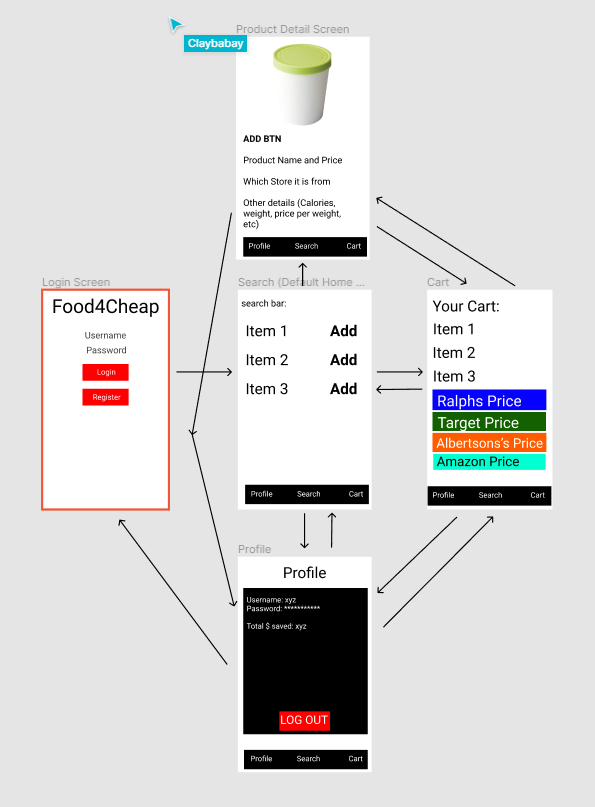

App Design Project 
===

# SuperPrice

## Table of Contents
1. [Overview](#Overview)
1. [Product Spec](#Product-Spec)
1. [Wireframes](#Wireframes)
2. [Schema](#Schema)

## Overview
### Description
The overall idea behind this app is provide a mobile way of comparing and contrasting prices of specific products among popular supermarkets, such as Target, Kroger, and Walmart.

### App Evaluation
[Evaluation of your app across the following attributes]
- **Category:**
Finance 
- **Mobile:**
With required user stories, the app functions the same as if it was used on a desktop. However, it is a lot convient to check prices on a mobile phone rather than going home to check on the computer.
- **Story:**
It's a way to save money by shopping at cheaper locations which would be appreciated by friends and peers.
- **Market:**
Practically anyone who does grocery shopping would have a reason to be interested in this app which is a lot of people.
- **Habit:**
It's unlikely people would use this app in their free time nor is it addictive to like up prices for supermarket products. Users will primarily be consuming the app, not creating except for groccery list. 
- **Scope:**
A polish version of this app with extra features will likely be complicated and hard to complete by the end unless we commit alot of time. However, meeting the required user stories will still result a usable app with practical application

## Product Spec

### 1. User Stories (Required and Optional)

**Required Must-have Stories**

* Be able to search products and their details from at least 3 different major supermarkets(Target,Walmart,Albertsons, Trader Joes, Pavilions, something).
* Cart function so that you can add all the products you want into one place so that you can compare the overall price.
* Be able to create and log into accounts that save the list of products you want to buy.

**Optional Nice-to-have Stories**

* Functionality to share the list with other accounts and check off items which have been purchased.
* Be able to select which store you want to shop at and open its location on Google Maps.

### 2. Screen Archetypes

* Login Screen
   * User can login
   * User can create a new account
* Search
   * User can search for products
* Cart
   * User can view their list of products
* Product Detail Screen
    * User can click on a product from the list and open a screen of that product with more details (Bigger image, store it is from, cost per weight, etc).
* Profile
   * User can logout

### 3. Navigation

**Tab Navigation** (Tab to Screen)

* Search Product
* Shopping Cart
* Profile

**Flow Navigation** (Screen to Screen)

* Login Screen
   * Search
* Search
   * Product Detail
* Cart
   * Product Detail
* Profile
   * Login (when signing out)
* Product Detail
   * Search
   * Cart

## Wireframes
[Add picture of your hand sketched wireframes in this section]

### [BONUS] Digital Wireframes & Mockups

### [BONUS] Interactive Prototype

## Schema 

### Models
#### ProductItem

   | Property      | Type     | Description |
   | ------------- | -------- | ------------|
   | objectId      | String   | unique id  |
   | UPC        | String| UPC code unique to each product |
   | image         | String     | image of product |
   | Description       | String   | Description of the item |
   | Unit | Number   | Amount per item (1 pound, 1 item, etc.) |
   | Price    | Number   | Regular price of the item |
   | Store    | String   | What store the item is sold at |
   
#### User
| Property      | Type     | Description |
   | ------------- | -------- | ------------|
   | userId      | String   | unique id for the user  |
   | username        | String| Name of the user|
   | password       | String     | password for user |
   | shoppingCart      | Object     | Custom object to store items user wants to purchase |
  
#### ShoppingCart
| Property      | Type     | Description |
   | ------------- | -------- | ------------|
   | objectId      | String   | unique id for the cart  |
   | Items       | List of ProductItem | A list containing ProductItem objects that the user has selected to buy|

### Networking
#### List of network requests by screen
   - Login Screen
      - (Sign up/POST) Make a new account
      - (Login/GET) Log into an already created account
   - Search Screen
      - (Search/GET) Get a list of ProductItem from the Kroger API
      - (Add/POST) Allow the user to add a ProductItem to their Cart 
   - Profile Screen
      - (Update/PUT) Log the user out of the app
   - Cart Screen
      - (RemoveItem/DELETE) Be able to remove an item from the cart.
      - (GET) Be able to get the data from the cart object and display it

#### [OPTIONAL:] Existing API Endpoints
##### An API Of Ice And Fire
- Base URL - [https://api.kroger.com/v1]

   HTTP Verb | Endpoint | Description
   ----------|----------|------------
    `GET`    | /connect/oauth2/token | Get an access token
    `GET`    | /products | return a list of products from a store
    `GET`    | /locations   | Return a list of locations

